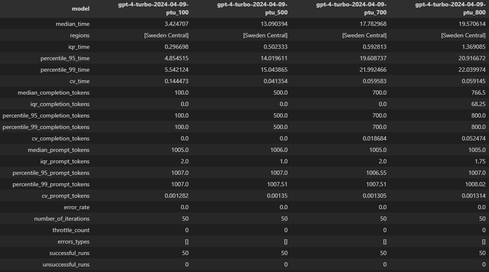

# Comprehensive Guide to Running Latency Tests

This guide provides a detailed walkthrough on how to execute latency tests using the `run_latency_benchmark_bulk` method, initialize the testing classes, and interpret the results effectively. Follow these steps to ensure a professional and thorough evaluation of your deployments' performance.

## 🚀 Getting Started

### Prerequisites

- Ensure you have access to the deployment names and the Azure OpenAI API key.
- Familiarize yourself with the parameters that the `run_latency_benchmark_bulk` method accepts.

### Step 1: Define Test Parameters

First, you need to define the parameters for your test:

- **Deployment Names**: An array of deployment names you wish to test.
- **Token Counts**: A list of maximum token counts to test against each deployment.

```python
deployment_names = ["YourModelName1", "YourModelName2"]
max_tokens_list = [100, 500, 700, 800, 900, 1000]
```

### Step 2: Initialize the Testing Class
Depending on whether your test is for streaming or non-streaming deployments, initialize the appropriate class. Here's how to initialize for non-streaming:


```python
from src.performance.aoaihelpers.latencytest import AzureOpenAIBenchmarkNonStreaming

client_non_streaming = AzureOpenAIBenchmarkNonStreaming(
    api_key="YOUR_AZURE_OPENAI_API_KEY",
    azure_endpoint="YOUR_AZURE_OPENAI_ENDPOINT",
    api_version="YOUR_AZURE_OPENAI_API_VERSION"
)
```

### Step 3: 🛠️ Execute the Tests
Run the run_latency_benchmark_bulk method with your defined parameters:

```python
await client_non_streaming.run_latency_benchmark_bulk(
    deployment_names, max_tokens_list, iterations=1, context_tokens=1000, multiregion=False
)
```

### Step 4: 📊 Interpreting the Results

After running the tests, the results will be stored in the `self.results` attribute of your testing class instance. Here's how to interpret key metrics effectively:

- **Median Time**: Reflects the typical response time. *Lower is better.*
- **95th and 99th Percentile Time**: Indicates the worst-case response times. *Essential for understanding scalability under load.*
- **Coefficient of Variation (CV)**: Shows the variability of response times and completion tokens. *Lower CV indicates more consistent performance.*
- **Error Rate**: High error rates may signal issues with specific configurations or overload scenarios.
- **Best and Worst Runs**: Analyzing these can help identify optimal configurations and potential bottlenecks.



#### Detailed Metrics Explained:

- **Iterations**: The number of times the test was repeated to gather data.
- **Regions**: The data center region where the test was conducted.
- **Median Time**: The median latency time (in seconds) for the API to return a response.
- **IQR Time**: The interquartile range (IQR) of the latency times, showing the middle 50% of data to measure variability.
- **95th Percentile Time**: The latency time below which 95% of the responses fall.
- **99th Percentile Time**: The latency time below which 99% of the responses fall.
- **CV Time**: The coefficient of variation for the latency times, indicating relative variability.
- **Median Prompt Tokens**: The median number of prompt tokens sent in each API call.
- **IQR Prompt Tokens**: The interquartile range of prompt tokens, indicating variability.
- **Median Completion Tokens**: The median number of tokens generated by the model in response.
- **IQR Completion Tokens**: The interquartile range of completion tokens, indicating variability.
- **95th Percentile Completion Tokens**: The number of completion tokens below which 95% of the responses fall.
- **99th Percentile Completion Tokens**: The number of completion tokens below which 99% of the responses fall.
- **CV Completion Tokens**: The coefficient of variation for completion tokens, indicating relative variability.
- **Error Rate**: The percentage of test runs that resulted in errors.
- **Error Types**: The types of errors encountered during the test runs.
- **Successful Runs**: The number of test runs that were successful.
- **Unsuccessful Runs**: The number of test runs that were unsuccessful.
- **Throttle Count**: The number of times the API calls were throttled.
- **Best Run**: The details of the best-performing test run in terms of latency.
- **Worst Run**: The details of the worst-performing test run in terms of latency.

By following this guide, you'll be equipped to perform comprehensive latency tests on your deployments, allowing for informed decisions to optimize performance and reliability.

For a hands-on approach to executing your tests, please refer to our Jupyter Notebook: [benchmarks/gpt-4-turbo/run-benchmarking.ipynb](benchmarks/gpt-4-turbo/run-benchmarking.ipynb). This notebook provides a step-by-step tutorial to get you started with latency benchmarking, making it easier to apply the concepts discussed in this guide to your specific use case.

Happy Testing! 🚀